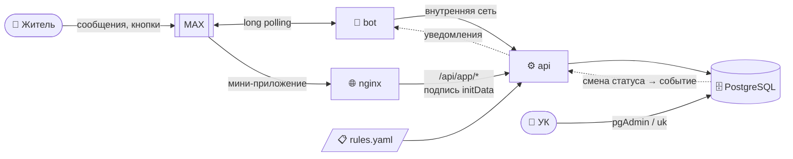

<div align="center">

# 🏠 Диспетчер ЖКХ в MAX

**Житель пишет «течёт с потолка» — УК получает заявку с адресом, ответственным и сроком.**

Чат-бот и мини-приложение для мессенджера MAX · трек «Умный город» · хакатон MAX 2026


[🚀 Установка на VPS](#-установка-на-vps-за-5-минут) ·
[✨ Что умеет](#-что-умеет) ·
[🧭 Как устроено](#-как-устроено) ·
[📚 Документация](#-документация) ·
[📝 Журнал](#-журнал-изменений)

</div>

---

## ✨ Что умеет

### 👤 Для жителя

| | |
|---|---|
| 🔐 **Вход в одно касание** | «Поделиться контактом» — и бот знает квартиру. Подпись контакта MAX проверяется: чужой номер не подставить |
| 💬 **Заявка прямо в чате** | 11 типов проблем → уточнение → место → описание → «Отправить». «« Назад» и «Отмена» на каждом шаге; бот меняет одно сообщение, а не засыпает ленту |
| 🛠️ **Услуги** | «Заказать услугу»: поверка счётчика ХВС/ГВС (кухня / ванная → ГВС / ХВС), замена батарей (кухня / комната → сколько комнат). Замена счётчиков — в списке проблем |
| 🆘 **Аварии — сразу** | Газ, искрящая проводка, прорыв воды, человек в лифте: инструкция «что делать прямо сейчас» и экстренная заявка. Такие кнопки помечены 🆘 — «без подтверждения». Бот узнаёт аварию и по словам — «пахнет газом» |
| 📱 **Мини-приложение** | Те же заявки формой, список «Мои заявки», отмена, чат дома — внутри MAX |
| 🔔 **Статус без звонков в УК** | Взяли в работу, решили — бот пишет сам, с датой и временем смены статуса. «статус 12» — подробности в любой момент |
| 🏘️ **Чат дома** | Ссылка на чат соседей — по данным УК, QR-коду в подъезде или введённому адресу. Квартиры в нескольких домах — выбор дома |

### 🏢 Для управляющей компании

| | |
|---|---|
| 🧠 **Маршрутизация** | Тип + место + уточнение → кто отвечает (УК, водоканал, газовая служба…) и нормативный срок. Правила — в [`config/rules.yaml`](config/rules.yaml), правятся без пересборки |
| 🗃️ **Работа в pgAdmin** | Сменил статус в таблице — житель через пару секунд получил уведомление (триггер в БД) |
| 📥 **Жители из Excel** | Импорт CSV, команда `uk` для домов и жителей, архив вместо удаления — история заявок не теряется |

### 🛡️ Надёжность — по чек-листу тестирования

Двойное нажатие «Отправить» → одна заявка · фото и стикеры вместо ответа → вежливый повтор вопроса · 4000 символов с эмодзи → сохраняются целиком · брошенная заявка → «Продолжить / Начать заново» · нет сети → понятная ошибка и повтор.

---

## 🚀 Установка на VPS за 5 минут

Нужен сервер на **Ubuntu 22.04 / 24.04** с **российским IP**, 2 ГБ RAM, токен бота от **@MasterBot** в MAX и (для мини-приложения) два домена, смотрящие на сервер.

> ⚠️ С зарубежного VPS (проверено на Финляндии, 27.09.2026) MAX Bot API недоступен — бот не запустится.
> Установщик проверяет это первым делом; вручную: [`docs/max-notes.md`](docs/max-notes.md).

### 1️⃣ Доступ к репозиторию

Репозиторий приватный — серверу нужен **deploy-ключ** (только чтение, только этот репозиторий):

```bash
ssh-keygen -t ed25519 -f ~/.ssh/max_deploy_key -N "" -C "vps-deploy"
cat ~/.ssh/max_deploy_key.pub
```

Ключ → GitHub → **Settings → Deploy keys → Add deploy key**, галочку «Allow write access» не ставить.

Git сам пробует только ключи со стандартными именами (`id_ed25519`, `id_rsa`) — этот ему нужно назвать,
иначе клон упадёт с `Permission denied (publickey)`:

```bash
printf 'Host github.com\n  HostName github.com\n  User git\n  IdentityFile ~/.ssh/max_deploy_key\n  IdentitiesOnly yes\n' >> ~/.ssh/config
chmod 600 ~/.ssh/config
ssh -T git@github.com
```

Ответ `Hi EEGRINO/magistral-dispatcher-max! …` значит, что ключ работает. Подробнее — [`docs/RUN.md`](docs/RUN.md#доступ-с-сервера-к-приватному-репозиторию).

### 2️⃣ Запустить установщик

```bash
git clone git@github.com:EEGRINO/magistral-dispatcher-max.git /tmp/max-setup
sudo bash /tmp/max-setup/scripts/deploy-vps.sh
```

Скрипт задаёт вопросы — **Enter принимает значение по умолчанию** в `[скобках]`. Пока вы не ответили «Начинаем?», на сервере ничего не меняется.

```text
━━ Куда ставить ━━
? Каталог установки [/opt/max-dispatcher]
? Репозиторий [git@github.com:EEGRINO/magistral-dispatcher-max.git]
? Ветка [main]

━━ Порты Docker ━━
  api: 3000   PostgreSQL: 5432
! Порт PostgreSQL 5432 занят (часто — системный Postgres).
? Порт api [3000]
? Порт PostgreSQL [5433]

━━ Бот MAX ━━
? Токен бота (ввод скрыт, Enter — позже):
? Загрузить тестовые данные (дома и УК для демо)? [y/N]

━━ База данных PostgreSQL ━━
? Логин пользователя БД [max]
? Название БД [max_dispatcher]
? Пароль пользователя БД (ввод скрыт, Enter — сгенерировать):

━━ nginx, домен и HTTPS ━━
? Настроить nginx? [Y/n]
? Привязать домен? [Y/n]
? Основной домен (например, example.ru) example.ru
? Домен api [api.example.ru]
? Домен мини-приложения [app.example.ru]
? Каталог статики мини-приложения [/var/www/app.example.ru]
? Выпустить HTTPS-сертификаты Let's Encrypt (certbot)? [Y/n]
? Email для уведомлений Let's Encrypt (Enter — без email)

━━ Сводка ━━
  …
? Начинаем? [Y/n]
```

<details>
<summary><b>Что именно делает скрипт</b></summary>

| Шаг | Что происходит |
|---|---|
| 🐳 Docker | Docker Engine + compose-plugin из официального репозитория Docker (не snap, не `docker.io`) |
| 📦 Код | клонирует репозиторий или обновляет существующую установку (`--ff-only`) |
| 🔑 `.env` | создаёт из `.env.example`, пишет порты, токен, логин / пароль / имя БД (пароль по Enter — случайный). Уже заполненный `.env` не затирает |
| 🗄️ PostgreSQL | логин, пароль и имя БД спрашиваются, только пока база не создана: потом их не сменить без пересоздания — скрипт так и скажет |
| 🔌 Порты | api и PostgreSQL слушают только `127.0.0.1`. Занятый порт замечает сам и предлагает ближайший свободный |
| ▶️ Запуск | `docker compose up -d --build`: db → migrate (схема БД) → api → bot |
| 🌐 nginx | с доменом — два сайта: api (наружу только `/health`) и мини-приложение (статика + `/api/app/`), всё остальное — 404. Без домена — мини-приложение на свободном порту (8080) по IP, для проверки: MAX принимает только `https://`. Старые конфиги — в `*.bak-<время>`, при ошибке `nginx -t` откат |
| 🔒 HTTPS | certbot выпускает сертификаты и включает редирект http → https |
| 🧱 ufw | если файрвол включён — по вопросу открывает 80 и 443 |

Токен бота вводится скрыто и попадает только в `.env` — ни в историю команд, ни в вывод.
Домен уже обслуживает другой конфиг nginx — скрипт его не трогает и скажет об этом.

</details>

<details>
<summary><b>Флаги</b></summary>

| Флаг | Зачем |
|---|---|
| `--dry-run` | задать вопросы и показать сводку и конфиги nginx, **ничего не меняя** |
| `--yes` | без вопросов, всё по умолчанию (nginx не настраивается) |
| `--help` | справка |

</details>

### 3️⃣ Последний штрих

- в настройках бота на **business.max.ru** указать адрес мини-приложения — `https://app.ваш-домен`;
- завести дома и жителей — командой `uk` или в pgAdmin ([`docs/RUN.md`](docs/RUN.md#дома-и-жители-команда-ук));
- написать боту `/start` → «Поделиться контактом». ✅

### 🔄 Обновление

```bash
cd /opt/max-dispatcher && git pull && docker compose up -d --build
docker compose --profile deploy run --rm --build miniapp-build
```

Вторая команда нужна, только если менялся `miniapp/`. Новые миграции БД применяются сами при `up`.

---

## 💻 Локальный запуск

```bash
cp .env.example .env
git config core.hooksPath .githooks
docker compose up --build
```

В `.env` впишите `MAX_BOT_TOKEN`. Вторая команда включает проверку секретов перед каждым коммитом.

Проверка: `curl http://localhost:3000/health` → `{"status":"ok","db":"ok",…}`, затем `/start` боту в MAX.
Номер телефона должен быть заранее заведён в базу — `SEED_TEST_PHONES` в `.env` и seed ([`db/README.md`](db/README.md)).
Логи: `docker compose logs -f bot`.

---

## 🧭 Как устроено



- **bot** — диалог через MAX Bot API, long polling: публичный адрес боту не нужен.
- **api** — Fastify + TypeBox: жители, заявки, маршрутизация, мини-приложение. Контракт — [`docs/api.md`](docs/api.md).
- **db** — PostgreSQL 16, миграции `node-pg-migrate` применяются автоматически. Устройство — [`docs/db-overview.md`](docs/db-overview.md).
- **miniapp** — React + MAX UI, собирается в статику, раздаёт системный nginx.

| Каталог | Что внутри |
|---|---|
| [`bot/`](bot/) | диалог с жителем |
| [`api/`](api/) | бизнес-логика, команда УК `uk` |
| [`miniapp/`](miniapp/) | мини-приложение жителя |
| [`db/`](db/) | миграции и тестовые данные |
| [`config/`](config/) | `rules.yaml`, `norms.yaml` — справочники без пересборки |
| [`scripts/`](scripts/) | установщик на VPS, проверка секретов |
| [`docs/`](docs/) | документация |

---

## 📚 Документация

| Документ | О чём |
|---|---|
| [`docs/RUN.md`](docs/RUN.md) | запуск, деплой, nginx, работа УК, разбор реальных проблем |
| [`docs/excel-import.md`](docs/excel-import.md) | импорт жителей из Excel: как оформить таблицу, шаблон, ошибки |
| [`docs/api.md`](docs/api.md) | контракт api — на него завязаны бот и мини-приложение |
| [`docs/db-overview.md`](docs/db-overview.md) | как устроено хранение данных — без SQL |
| [`docs/Решения_проекта.md`](docs/Решения_проекта.md) | принятые решения и почему |
| [`docs/max-notes.md`](docs/max-notes.md) | **единственный** источник правды по MAX Bot API и Bridge |
| [`docs/EXPLANATORY-NOTE.md`](docs/EXPLANATORY-NOTE.md) | пояснительная записка для защиты |

> ⚠️ Про MAX Bot API читать только [`docs/max-notes.md`](docs/max-notes.md): в июле 2026 MAX сменил домен
> на `platform-api2.max.ru` и запретил токен в query — статьи и SDK в интернете описывают мёртвый API.

---

## 📝 Журнал изменений

Полная версия с обоснованиями — **[docs/CHANGELOG.pdf](docs/CHANGELOG.pdf)** (источник — [`docs/changelog.html`](docs/changelog.html),
пересборка: `node scripts/build-changelog-pdf.mjs`). Дни считаются от сдачи: Д-0 — 30.09.

<details open>
<summary><b>28.09 · Д-2 — аварийные телефоны, сверка контракта</b></summary>

- Авария у дома без телефона АДС — одна кнопка «112 — единый номер экстренных служб» вместо двух одинаковых
- Контракт api сверен с поведением: лишние поля запроса отбрасываются, а не дают ошибку
- Полный прогон: сборка, тесты api, все сценарии бота на чистой базе — без ошибок

</details>

<details>
<summary><b>27.09 · Д-3 — услуги, установщик, база по-русски</b></summary>

- «Заказать услугу» в боте и мини-аппе: поверка счётчика ХВС/ГВС, замена батарей отопления
- «Замена счётчиков ГВС/ХВС» в списке проблем
- Дата и время смены статуса — в уведомлении и в карточке заявки
- Экстренные варианты помечены 🆘 с плашкой «без подтверждения»
- Под уведомлением о статусе — «Подробнее» и «Понятно»: меню всегда внизу чата
- Интерактивный установщик на VPS: порты, БД, домен, nginx, HTTPS, Enter — значение по умолчанию
- Установщик проверяет доступ к MAX Bot API, обходит закрытые из России `download.docker.com` и Docker Hub, работает за Nginx Proxy Manager
- ФИО жителя; русские копии таблиц в pgAdmin для сверки правки
- Импорт жителей из Excel: инструкция и шаблоны

</details>

<details>
<summary><b>26.09 · Д-4 — мини-приложение на живых данных, чек-лист тестирования</b></summary>

- Уведомления жителю о смене статуса; статус можно менять прямо в pgAdmin
- Мини-приложение на настоящих данных — житель по подписи `initData` MAX
- Отмена заявки жителем, время подачи «дд.мм.гггг, чч:мм» по поясу дома
- Бот меняет одно «живое» сообщение, «« Назад» на каждом шаге
- Чек-лист: двойное нажатие, фото и стикеры, длинный текст, несуществующий дом в ссылке, нет сети, брошенная заявка
- Несколько квартир у жителя (миграция `0009`), выбор дома в заявке и в «Чате дома»

</details>

<details>
<summary><b>25.09 · Д-5 — интерфейс мини-приложения</b></summary>

- Экраны мини-приложения по сценарию бота: мои заявки, сообщить о проблеме, чат дома

</details>

<details>
<summary><b>24.09 · Д-6 — сценарий жителя и маршрутизация</b></summary>

- Вход по подписанному контакту MAX вместо «найти или создать»
- Меню и «Чат дома» — дом по данным УК, QR-коду или адресу
- Экстренная ветка: газ, искрящая проводка, прорыв воды, человек в лифте
- Обычная заявка в диалоге, зона собственника; модель Павла — 10 типов проблем
- Маршрутизация по `config/rules.yaml`: ответственный и срок
- «Мои заявки» и «статус N»
- Жильцов и дома ведёт УК: квартира, договор, архив, импорт CSV
- Наружу из api — только явно перечисленные пути, остальное 404

</details>

<details>
<summary><b>23.09 · Д-7 — деплой</b></summary>

- Системный nginx + certbot вместо Caddy, порты api и БД — только `127.0.0.1`

</details>

<details>
<summary><b>21.09 · Д-9 — КТ-1: сквозной провод MAX → бот → api → БД, каркас мини-приложения</b></summary>

- Схема БД, миграции `node-pg-migrate`, сервис `migrate` в compose
- api на Fastify + TypeBox, единый формат ошибок
- Цепочка MAX → бот → api → БД подтверждена живым сообщением в MAX
- Мини-приложение: React + MAX UI + MAX Bridge, макет заявок
- Скрипт установки на чистый VPS

</details>

<details>
<summary><b>20.09 · Д-10 — допуск: бот отвечает в MAX</b></summary>

- Бот на long polling со своим тонким клиентом MAX на `fetch` — без SDK на мёртвом домене
- Защита от секретов: pre-commit хук
- Russian Trusted CA — иначе `fetch` к MAX падает

</details>

<details>
<summary><b>19.09 · Д-11 — старт</b></summary>

- Репозиторий, `.gitignore`, шаблон `.env.example`

</details>

### ↩️ Отменённые решения

Чтобы через неделю никто не «починил» обратно то, что убрано осознанно:

| Было | Стало | Почему |
|---|---|---|
| Caddy контейнером в compose | системный nginx + certbot | на сервере уже был nginx, два TLS-терминатора дрались за 80/443 |
| `POST /residents/find-or-create` | вход по подписанному контакту MAX | жителя заводит УК; бот лишь привязывает аккаунт |
| таблица `routing_rules` | `config/rules.yaml` (миграция `0006`) | правила правятся без пересборки; таблица так и осталась пустой |
| у бота нет `depends_on` | зависимость от api настоящая | риск «бот молчит» снят в коде: api не ответил — бот говорит об этом |
| кнопка «Мини-апп (тест)» | одна кнопка «Отправить заявку ЖКХ» | тестовая ссылка больше не нужна |
| черновик заявки живёт 15 минут | живёт сутки + «Продолжить / Начать заново» | брошенную заявку можно продолжить (чек-лист, кейс 7) |
| квартира — колонки в `residents` | таблица `resident_premises` (`0009`) | у жителя бывает несколько квартир в разных домах |
| русские копии таблиц с выборочными столбцами (`0010`) | копии один в один с таблицей (`0011`) | чтобы открывать рядом с таблицей и сверять правку |

### 🔒 Аудит секретов

Токенов и ключей в истории репозитория нет — поиск по всем объектам всех коммитов, 0 совпадений.
Повторить: `sh scripts/check-secrets.sh --tracked`.

---

## 🛠️ Для разработчиков

Правила — в [CONTRIBUTING.md](CONTRIBUTING.md): Conventional Commits, секреты только в `.env`, схема БД и сценарий диалога — только после согласования.
Журнал пополняется в конце каждого дня: [`docs/changelog.html`](docs/changelog.html) → PDF → краткая версия здесь.
